<!--lint disable awesome-github awesome-list-item table-pipe-alignment double-link-->

  

# Awesome AI Workflows That Work 

A hand-built collection of 63 AI workflows, starter guides, and playbooks for people trying to automate real work without wading through hype.

If one workflow saves you an afternoon, star the repo and come back when you need the next one.

## Start Here

| If you want to... | Open this |
| --- | --- |
| ship code from issue to PR with agents | [Claude Code + Skills + GitHub](workflows/dev/claude-code-github-loop.md) |
| build a safer multi-agent coding loop | [AI Coding Agents Workflows](workflows/dev/ai-coding-agents.md) |
| connect an assistant to real tools and data | [The Standard MCP Stack](workflows/dev/mcp-standard-stack.md) |
| choose the right automation platform | [AI Workflow Platform Selection Guide](workflows/dev/ai-workflow-platform-selection.md) |
| run local models privately | [Local AI Stack](workflows/dev/local-ai-stack.md) |
| analyze CSV or Parquet with plain English | [DuckDB Local Analysis](workflows/research/duckdb-local-analysis.md) |
| turn meeting audio into usable notes | [AI Meeting Notes](workflows/MeetingNotes/ai-meeting-notes.md) |
| turn screenshots into actions | [Screenshot OCR to Action Items](workflows/productivity/screenshot-ocr-to-action-items.md) |
| build a study workflow from lectures and PDFs | [Lecture to Study Guide](workflows/productivity/lecture-to-study-guide.md) |
| run a structured job search | [Job Search Kanban](workflows/productivity/job-search-kanban.md) |
| move from idea to finished song faster | [Suno Song to Release](workflows/music/suno-song-to-release.md) |
| bootstrap a Windows machine with less clickwork | [Windows Software Bootstrap and Patching](workflows/devops/windows-software-bootstrap-and-patching.md) |

## Browse By Area

| Area | Best entry points |
| --- | --- |
| Build and code | [The Standard MCP Stack](workflows/dev/mcp-standard-stack.md), [LLM Cost Routing](workflows/dev/llm-cost-routing.md), [RAG Pipeline](workflows/dev/rag-pipeline.md) |
| Meetings and communication | [AI Meeting Notes](workflows/MeetingNotes/ai-meeting-notes.md), [Live Captions and Live Translation](workflows/MeetingNotes/live-captions-and-live-translation.md) |
| Research and data | [DuckDB Local Analysis](workflows/research/duckdb-local-analysis.md), [Natural Language to SQL Dashboard](workflows/research/nl-to-sql-dashboard.md) |
| Study, career, and productivity | [Lecture to Study Guide](workflows/productivity/lecture-to-study-guide.md), [Resume Tailoring with Proof](workflows/productivity/resume-tailoring-with-proof.md), [Task Management](workflows/productivity/task-management.md) |
| Marketing and content | [Blog Post Pipeline](workflows/marketing/blog-post-pipeline.md), [Content Repurposing Pipeline](workflows/marketing/social-content-repurposing.md) |
| Music, video, and media | [Suno Song to Release](workflows/music/suno-song-to-release.md), [Video Transcript to Content](workflows/video/video-transcript-to-content.md) |
| Security and operations | [MCP Security Checklist](workflows/security/mcp-security-checklist.md), [AI PR Review](workflows/devops/ai-pr-review.md) |

## Library

### Build and code

| Workflow | Focus |
| --- | --- |
| [AI Agent Frameworks](workflows/dev/agent-frameworks.md) | framework comparison |
| [Agentic Patterns](workflows/dev/agentic-patterns.md) | orchestration patterns and tradeoffs |
| [AI Coding Agents Workflows](workflows/dev/ai-coding-agents.md) | repeatable multi-agent coding loop |
| [AI Workflow Platform Selection Guide](workflows/dev/ai-workflow-platform-selection.md) | platform selection |
| [Automation Platforms and Workflow Engines Map](workflows/dev/automation-platforms.md) | automation layer comparison |
| [Browser Automation](workflows/dev/browser-automation.md) | browser-driven workflows |
| [Claude Code + GitHub Actions](workflows/dev/claude-code-github-actions.md) | async agent workflows in CI |
| [Claude Code + Skills + GitHub](workflows/dev/claude-code-github-loop.md) | issue-to-PR implementation loop |
| [Claude Skills Reference](workflows/dev/claude-skills-reference.md) | skills and app integration patterns |
| [Computer Use Agent with Open Interface](workflows/dev/computer-use-open-interface.md) | desktop control when APIs are not enough |
| [Cursor + Claude + Parallel Branching](workflows/dev/cursor-parallel-branching.md) | parallel coding with worktrees |
| [Frontend Component Systems for AI Shipping](workflows/dev/frontend-component-systems.md) | better UI generation constraints |
| [LLM Cost Routing](workflows/dev/llm-cost-routing.md) | multi-model cost control |
| [Local AI Stack](workflows/dev/local-ai-stack.md) | private local-model setup |
| [MCP Builders Playbook](workflows/dev/mcp-builders-playbook.md) | building MCP servers and adapters |
| [The Standard MCP Stack](workflows/dev/mcp-standard-stack.md) | practical MCP setup |
| [Idea to MVP in a Weekend](workflows/dev/mvp-weekend.md) | compressed solo-builder workflow |
| [n8n Templates](workflows/dev/n8n-templates.md) | n8n starting points |
| [RAG Pipeline](workflows/dev/rag-pipeline.md) | document-backed AI apps |
| [RSS Automation](workflows/dev/rss-automation.md) | feed-driven automation |
| [Windows MCP for Full Desktop Control](workflows/dev/windows-mcp-computer-control.md) | MCP-based Windows control |

### Meetings and communication

| Workflow | Focus |
| --- | --- |
| [AI Meeting Notes](workflows/MeetingNotes/ai-meeting-notes.md) | transcript to summary and actions |
| [Live Captions and Live Translation](workflows/MeetingNotes/live-captions-and-live-translation.md) | live captions and translation |

### Research and data

| Workflow | Focus |
| --- | --- |
| [DuckDB Local Analysis](workflows/research/duckdb-local-analysis.md) | local file analytics |
| [Natural Language to SQL Dashboard](workflows/research/nl-to-sql-dashboard.md) | ask data questions in plain English |

### Study, career, and productivity

| Workflow | Focus |
| --- | --- |
| [Accessible Reading Pack](workflows/productivity/accessible-reading-pack.md) | make dense digital reading easier |
| [Candidate Screening and Interview Scorecards](workflows/productivity/candidate-screening-and-interview-scorecards.md) | structured hiring review |
| [Contract Analysis](workflows/productivity/contract-analysis.md) | document review support |
| [Email Triage](workflows/productivity/email-triage.md) | inbox automation |
| [Interview Prep Briefing](workflows/productivity/interview-prep-briefing.md) | prep for interviews fast |
| [Invoice and Expense Review](workflows/productivity/invoice-and-expense-review.md) | finance document review |
| [Job Search Kanban](workflows/productivity/job-search-kanban.md) | track applications and follow-ups |
| [Knowledge Management](workflows/productivity/knowledge-management.md) | capture and synthesis loops |
| [Lecture to Study Guide](workflows/productivity/lecture-to-study-guide.md) | lecture notes into study material |
| [Mobile Morning Routine Automation](workflows/productivity/mobile-morning-routine.md) | daily startup automation |
| [Mobile PDF to Summary](workflows/productivity/mobile-pdf-to-summary.md) | PDF handling on phone |
| [Mobile Quick Capture and Follow-Up](workflows/productivity/mobile-quick-capture-and-follow-up.md) | capture and route notes fast |
| [PDF to Flashcards](workflows/productivity/pdf-to-flashcards.md) | reading into recall practice |
| [Pomodoro and Focus Mode Automation](workflows/productivity/pomodoro-focus-mode-automation.md) | focus sessions on mobile |
| [Resume Tailoring with Proof](workflows/productivity/resume-tailoring-with-proof.md) | customize a resume without inventing claims |
| [School and Admin Paperwork](workflows/productivity/school-and-admin-paperwork.md) | forms, signatures, and paperwork |
| [Screenshot OCR to Action Items](workflows/productivity/screenshot-ocr-to-action-items.md) | screenshots into tasks |
| [Task Management](workflows/productivity/task-management.md) | planning and weekly review |
| [Voice Memos to Task Inbox](workflows/productivity/voice-memos-to-task-inbox.md) | voice capture to structured tasks |

### Marketing and business content

| Workflow | Focus |
| --- | --- |
| [Blog Post Pipeline](workflows/marketing/blog-post-pipeline.md) | research to published post |
| [AI Customer Support Triage](workflows/marketing/customer-support-ai.md) | support triage and escalation |
| [Docs as Code with AI](workflows/marketing/docs-as-code.md) | documentation maintenance |
| [Content Repurposing Pipeline](workflows/marketing/social-content-repurposing.md) | one source to many native formats |

### Music, video, and media

| Workflow | Focus |
| --- | --- |
| [Music Production Automation](workflows/music/music-production-automation.md) | stems, versions, mastering, release prep |
| [Suno Song to Release](workflows/music/suno-song-to-release.md) | idea to editable song workflow |
| [AI Avatar and Dubbing with Consent](workflows/video/ai-avatar-and-dubbing-with-consent.md) | avatar video and localization |
| [AI Media Generation Map](workflows/video/ai-media-generation.md) | choose the right media workflow |
| [Video Transcript to Content](workflows/video/video-transcript-to-content.md) | repurpose recordings |
| [YouTube SEO Metadata](workflows/video/youtube-seo-metadata.md) | titles, descriptions, and publishing metadata |

### Security and operations

| Workflow | Focus |
| --- | --- |
| [AI PR Review](workflows/devops/ai-pr-review.md) | review automation |
| [Deepfake Verification and Response](workflows/security/deepfake-verification-and-response.md) | suspicious media review |
| [Desktop Agent Safety Checklist](workflows/security/desktop-agent-safety-checklist.md) | guardrails for full machine access |
| [Infrastructure as Code](workflows/devops/infrastructure-as-code.md) | infra planning and delivery |
| [MCP Security Checklist](workflows/security/mcp-security-checklist.md) | secure MCP usage |
| [Monitoring and Alerting](workflows/devops/monitoring-alerting.md) | alert diagnosis workflows |
| [Prompt Injection Defense](workflows/security/prompt-injection-defense.md) | LLM safety patterns |
| [Release Notes and Changelog Automation](workflows/devops/release-notes-and-changelog.md) | release communication |
| [Windows Software Bootstrap and Patching](workflows/devops/windows-software-bootstrap-and-patching.md) | Ninite, Scoop, and NinjaOne workflows |

## Templates

| Template | Use case |
| --- | --- |
| [templates/workflow-template.md](templates/workflow-template.md) | standard workflow writeups |
| [templates/nocode-workflow-template.md](templates/nocode-workflow-template.md) | low-code and no-code writeups |

## Contributing

Before opening a change:

1. Read [CONTRIBUTING.md](CONTRIBUTING.md).
2. Use one of the templates in [`templates/`](templates/).
3. Keep additions practical, differentiated, and source-backed.
4. Run `npm run lint`.
5. Run `npm run lint:workflows`.

## Research Notes

Upstream research and ecosystem tracking live in [resources/external-curated-sources.md](resources/external-curated-sources.md).

Category rules and audit notes live in [resources/category-system.md](resources/category-system.md) and [resources/repo-audit-and-fixes.md](resources/repo-audit-and-fixes.md).

License: CC0 1.0.
